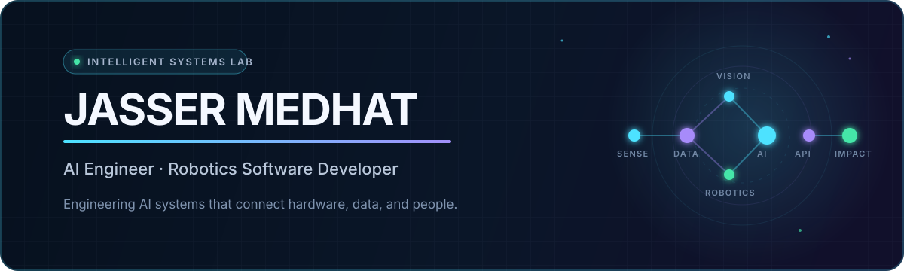
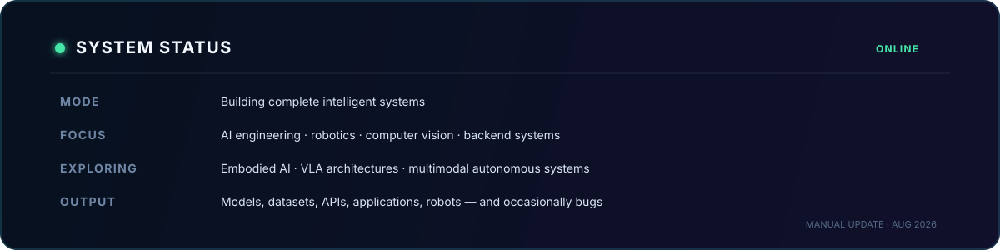
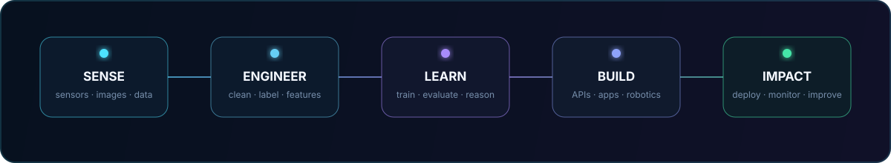

  

  

  
  
  
    
  

 

I am an **AI Engineer and Robotics Software Developer** based in Alexandria, Egypt. I build complete intelligent products: collecting and engineering data, training and evaluating models, connecting them to reliable APIs and backends, and delivering the final experience through web, mobile, embedded, or robotic systems.

I hold a **B.Sc. in Artificial Intelligence** from the Arab Academy for Science, Technology and Maritime Transport. My work sits where machine learning, computer vision, software engineering, and real-world hardware meet.

> **Open to:** AI/ML, robotics, computer-vision, and backend roles · freelance systems · engineering and research collaborations 
> **Languages:** Arabic — Native · English — Fluent · German — Intermediate

## Right now

  

## How I build

  

I am comfortable owning the full path from an idea to a working system. Depending on the problem, that can mean creating a dataset, designing the ML pipeline, exposing inference through FastAPI, building the product interface, containerizing the stack, or integrating perception and control on physical hardware.

## Research

- **[Benchmarking YOLOv8–YOLOv12 for Real-Time Object Detection on Single-Board Computers](https://doi.org/10.3390/make8070204)** — *Machine Learning and Knowledge Extraction*, 2026. Peer-reviewed and published.
- **IntelliGlove: Calibration-Aware Wearable Signal Processing and Reproducible Benchmarking for Arabic/Hijaiyah Smart-Glove Recognition** — under review, 2026.

## Selected systems

| Project | What it does |
| :--- | :--- |
| **[IntelliGlove](https://github.com/jassermedhat/IntelliGlove)** | Wearable Arabic Sign Language recognition system spanning custom sensor hardware, a 2,910-sample dataset, ML inference, FastAPI, PostgreSQL, Flutter, and React. **98.28% accuracy across 28 letters.** |
| **[NileOpt AI](https://github.com/jassermedhat/nileopt)** | Health-aware hydropower dispatch system for the Aswan High Dam, combining forecasting, physics-informed ML, anomaly risk, and constrained optimization. |
| **[VisionCart](https://github.com/jassermedhat/visioncart-autonomous-checkout)** | Autonomous computer-vision checkout that turns camera input into a reviewable basket and receipt using YOLO, FastAPI, and React. |
| **[RecomAI](https://github.com/jassermedhat/RecomAI)** | Local, explainable AI shopping assistant with structured LLM recommendations, deterministic ranking, persistent buyer memory, FastAPI, and React. |
| **[Medical Record Integrity Checker](https://github.com/jassermedhat/medical-record-blockchain-integrity)** | Educational blockchain prototype for detecting tampered medical files using local SHA-256 fingerprinting, Solidity, Hardhat, and role-aware workflows. |
| **AI Sports Training Platform** | Full-stack AI and RAG system for personalized planning, conversational support, and resource management using React, FastAPI, PostgreSQL, Docker, FAISS, and Gemini. |

<strong>More projects and experiments</strong>

 

| Project | Focus |
| :--- | :--- |
| **[Educational MCQ Generator](https://github.com/jassermedhat/NLP)** | Natural-language processing pipeline for generating educational multiple-choice questions. |
| **[Multimodal AI System](https://github.com/jassermedhat/DecodeLabs-Internship)** | Combined image, speech, and text processing in one intelligent workflow. |
| **RoboCup Autonomous Service Robot Software** | ROS-based perception, navigation, human–robot interaction, spatial reasoning, and autonomous task execution. |
| **NAO Humanoid Ball Tracking** | Vision-based red-ball detection and responsive head tracking using live camera feedback. |
| **YOLO Edge-AI Benchmarks** | Reproducible object-detection experiments across YOLOv8–YOLOv12 and multiple single-board computers. |
| **Airline Booking System** | End-to-end booking and management application built as a software-engineering project. |

<!-- To add a project later, copy one row in either project table and replace its title, link, and one-sentence description. -->

## Engineering capability map

| Area | Tools and capabilities |
| :--- | :--- |
| **AI & Machine Learning** | Python · PyTorch · TensorFlow/Keras · scikit-learn · deep learning · computer vision · YOLO · object detection · RAG · AI agents |
| **Data & Model Engineering** | NumPy · Pandas · dataset creation · cleaning · preprocessing · augmentation · feature engineering · training · evaluation · Matplotlib · Jupyter |
| **Backend & Product Delivery** | FastAPI · REST APIs · PostgreSQL · SQL · Alembic · Docker · React · JavaScript · Node.js · Flutter/Dart |
| **Robotics & Edge AI** | ROS1 · ROS2 · Gazebo · RViz · SLAM · navigation · HRI · sensor integration · single-board computers |
| **Embedded & Hardware** | C/C++ · Embedded C · ESP32 · Arduino · IMU/flex sensors · motor drivers · SolidWorks |
| **Engineering Foundations** | Git · Linux · Java · testing · modular architecture · system integration · technical documentation |
| **Currently exploring** | Embodied AI · vision-language-action models · multimodal autonomous systems · modern robot-learning architectures |

## Robotics and competition record

- **RoboCup @Home Egypt:** national **1st Place** and **4th Place**; developed ROS1 autonomous service-robot software across three competition seasons.
- **FIRST LEGO League Challenge:** five-time participant; **Best Programming**, **Best Mechanical Design** twice, and **Best Research**.
- **College Line Tracking:** **1st Place**.
- **ECPC:** two-time participant in the Egyptian Collegiate Programming Contest.
- **FTC, ARC, and WRO:** 10+ robotics competition appearances.

<strong>Training and additional background</strong>

 

- Training and Parallelisation of Large Language Models — Virginia Tech
- Data Science Program — GCI World, 2026
- RoboCup @Home Education Workshop
- Flutter Mobile Development training
- Coursework in machine learning, deep learning, computer vision, NLP, reinforcement learning, advanced robotics, swarm intelligence, embedded systems, and IoT

## The journey so far

| Stage | Direction |
| :--- | :--- |
| **2022** | Began studying Artificial Intelligence and developing autonomous robotics systems. |
| **2022–2025** | Built perception, navigation, HRI, and spatial-reasoning software through three RoboCup seasons. |
| **2024–2026** | Expanded into computer vision, embedded intelligence, research, and full-stack AI engineering. |
| **2026** | Graduated and co-authored published edge-AI research. |
| **Next** | Deeper work in embodied intelligence, VLA models, and dependable autonomous systems. |

## Let’s build something useful

I am interested in ambitious AI products, robotic systems, computer-vision applications, backend platforms, and freelance builds where the model is only one part of a complete working solution.

  <a href="mailto:jasser782004@gmail.com"><strong>Email me</strong></a>
  &nbsp;·&nbsp;
  <a href="https://www.linkedin.com/in/jasser-medhat"><strong>Connect on LinkedIn</strong></a>
  &nbsp;·&nbsp;
  <a href="https://orcid.org/0009-0007-9544-063X"><strong>View ORCID</strong></a>

 

  Built with models, sensors, APIs, and a suspicious amount of debugging.

