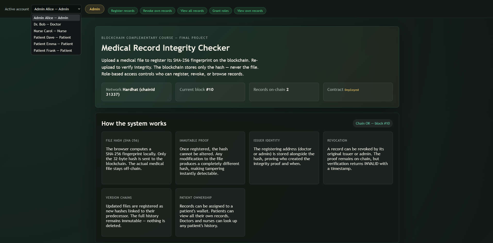
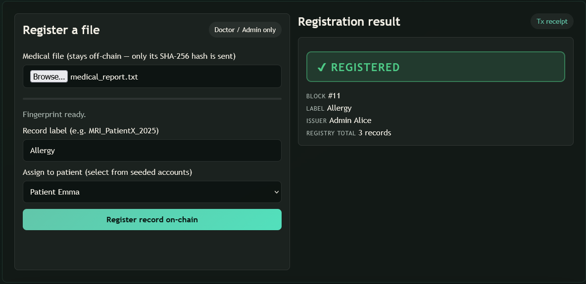
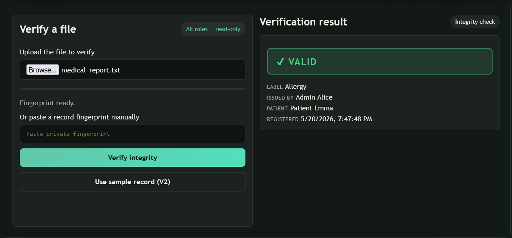
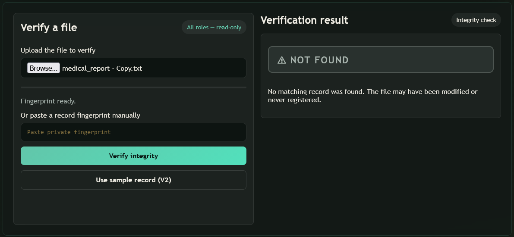
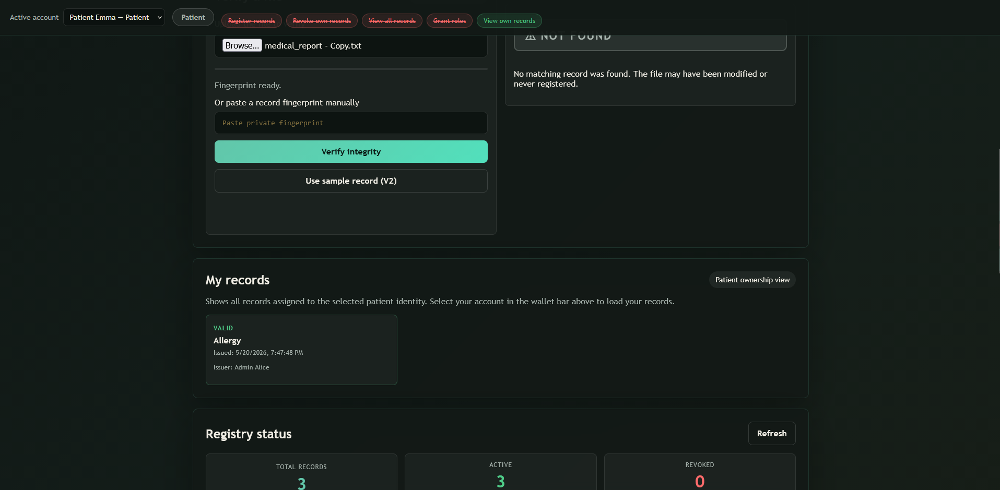
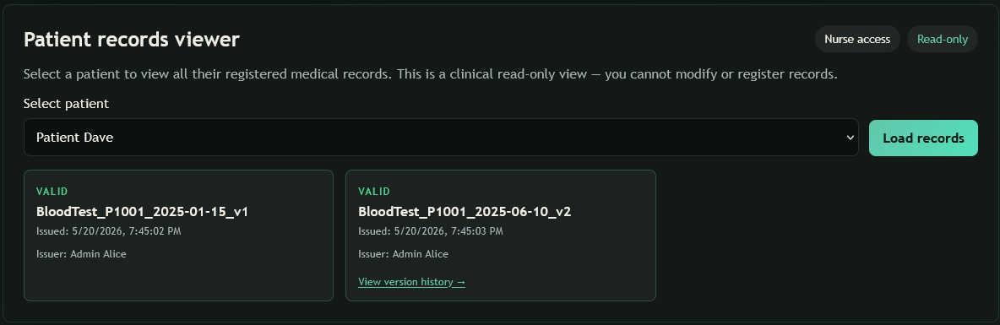
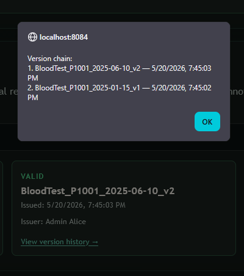
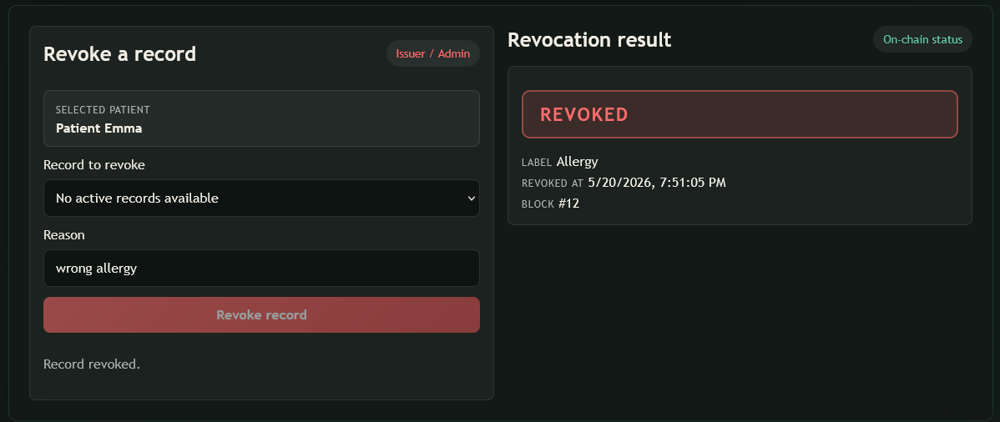

# Medical Record Integrity Checker

## Short Summary

Medical Record Integrity Checker is an educational local blockchain prototype that verifies medical record integrity by storing SHA-256 file hashes on a local Hardhat blockchain. The project includes a Solidity record registry, Admin/Doctor/Nurse/Patient demo roles, patient-specific record views, staff lookup workflows, record versioning, revocation, an Express.js API bridge, and a vanilla JavaScript frontend.

The browser computes the file fingerprint locally. The blockchain stores only the hash and demo metadata, not the medical file.

## Note / Disclaimer

This is an educational local demo using simulated Hardhat accounts. It is not intended for production medical data. It does not implement production wallet authentication, real identity management, HIPAA/GDPR compliance, or healthcare-grade privacy controls.

## Demo Video

Watch the 2-minute walkthrough demo:

[](https://drive.google.com/file/d/1o7zaiEWHfZ68W0090kigGokcSbBoAwUw/view?usp=drive_link)

The demo shows the full workflow: selecting a role, registering a medical record, verifying a valid file, detecting an unknown/tampered file, viewing patient records, creating versions, and revoking a record.

## Key Features

- SHA-256 file integrity verification
- Solidity smart contract record registry
- Admin, Doctor, Nurse, and Patient demo roles
- Patient-specific record access
- Staff patient lookup with authorization checks
- Record versioning
- Record revocation
- Express.js API bridge
- Vanilla JavaScript frontend
- Docker Compose local setup
- Hardhat tests

## Demo Flow

1. Select a simulated demo role/account from the frontend.
2. Register a medical record as Doctor/Admin by hashing a file locally and assigning it to a patient.
3. Verify a valid, revoked, unknown, or tampered file by uploading it or pasting a hash.
4. View patient records through the patient ownership view or staff clinical lookup.
5. Revoke a record as Admin or the original issuer.
6. Create and view immutable record versions.
7. Use Admin/debug tools for role management, event history, and local block inspection.

## Screenshots

### Dashboard


### Register Record


### Verify Valid Record


### Verify Unknown / Tampered Record


### Patient Records


### Staff Patient Viewer


### Version History


### Revoke Record


## Tech Stack

- Solidity
- Hardhat
- Ethers.js
- Express.js
- Vanilla JavaScript
- HTML/CSS
- Docker Compose
- Node.js

## Architecture Overview

- Smart contract: `MedicalRecordIntegrity.sol` stores SHA-256 record hashes, patient ownership, custom roles, version links, and revocation status.
- API: `api/src/server.js` connects the frontend to the local blockchain, validates request fields, checks demo caller roles, and sends transactions from selected local Hardhat accounts.
- Frontend: `frontend/` provides user-friendly demo workflows for registering, verifying, viewing, versioning, revoking, and inspecting records.
- Docker Compose: `docker-compose.yml` runs the local Hardhat chain, deployer, API, frontend, and optional Python demo container.

## Project Structure

```text
.
|-- api/                         Express API bridge
|   `-- src/server.js
|-- blockchain/
|   |-- contracts/               Solidity smart contract
|   |-- deployments/             Placeholder for generated local deployment JSON
|   |-- scripts/                 Hardhat deployment and seeded demo data
|   `-- test/                    Hardhat contract tests
|-- docs/
|   `-- screenshots/             Portfolio screenshots used by this README
|-- frontend/                    Static HTML/CSS/JavaScript demo UI
|-- python/                      Small SHA-256 educational demo
|-- docker-compose.yml           Standalone local full-stack setup
|-- package.json                 Root convenience scripts
|-- PROJECT_EXPLANATION.md       Deeper technical explanation
|-- SYSTEM_ACTIONS_AND_SEQUENCE.md
`-- GITHUB_PORTFOLIO_READINESS.md
```

Generated folders such as `node_modules/`, Hardhat `artifacts/`, Hardhat `cache/`, and local deployment JSON files are intentionally ignored.

## How to Run With Docker

Docker Desktop must be running before starting the stack.

```bash
docker compose up --build
```

Then open:

- Frontend: `http://localhost:8084`
- API health: `http://localhost:3004/api/health`
- Hardhat RPC: `http://localhost:8545`

The compose file starts a local Hardhat node, deploys `MedicalRecordIntegrity.sol`, seeds demo accounts/sample SHA-256 records, starts the API, and serves the frontend through nginx.

Note: `docker compose config` has been validated. Full startup requires Docker Desktop's Linux engine to be available on the machine running the project.

## How to Run Manually

From the repository root, install root convenience scripts if desired:

```bash
npm install
```

Terminal 1 - local blockchain:

```bash
cd blockchain
npm install
npm test
npx hardhat node
```

Terminal 2 - deploy contract and seed demo data:

```bash
cd blockchain
npx hardhat run scripts/deploy.js --network localhost
```

Terminal 3 - API:

```bash
cd api
npm install
npm start
```

Terminal 4 - frontend:

```bash
cd frontend
python -m http.server 8084
```

Then open `http://localhost:8084`.

PowerShell users can set custom API environment variables with:

```powershell
$env:RPC_URL="http://127.0.0.1:8545"
$env:LAB_ROOT=".."
npm start
```

On macOS/Linux, use `export RPC_URL=...` and `export LAB_ROOT=...`.

## Testing

Blockchain tests:

```bash
cd blockchain
npm test
```

API syntax check:

```bash
node --check api/src/server.js
```

Frontend syntax check:

```bash
node --check frontend/app.js
```

The Hardhat tests cover record registration, verification, duplicate hash rejection, patient ownership, staff patient lookup, version chains, revocation, and unauthorized caller behavior. The first Hardhat compile may require internet access to download the Solidity compiler.

## API Overview

| Method | Endpoint | Purpose |
| --- | --- | --- |
| `GET` | `/api/health` | API and local chain health |
| `GET` | `/api/accounts` | Seeded local demo accounts and role labels |
| `GET` | `/api/roles/check?address=...` | Role lookup for a demo account |
| `POST` | `/api/records/register` | Register a SHA-256 record hash |
| `POST` | `/api/records/verify` | Verify whether a record hash exists and is active |
| `GET` | `/api/records/:hash` | Read metadata for one registered hash |
| `GET` | `/api/records/history` | Recent register/revoke events |
| `GET` | `/api/patients` | Seeded patient demo accounts |
| `GET` | `/api/patients/me/records?caller=...` | Current caller's patient-owned records |
| `GET` | `/api/patients/:address/records?caller=...` | Same-patient or authorized staff record lookup |
| `POST` | `/api/records/version` | Register a new version linked to an existing hash |
| `GET` | `/api/records/:hash/versions` | Newest-first version chain |
| `POST` | `/api/records/revoke` | Revoke a record as Admin or original issuer |
| `POST` | `/api/roles/doctor/grant` | Admin grants Doctor role |
| `POST` | `/api/roles/doctor/revoke` | Admin revokes Doctor role |
| `POST` | `/api/roles/nurse/grant` | Admin grants Nurse role |
| `POST` | `/api/roles/nurse/revoke` | Admin revokes Nurse role |
| `GET` | `/api/chain/blocks?caller=...` | Admin-only local block explorer list |
| `GET` | `/api/chain/blocks/:number?caller=...` | Admin-only block details |
| `GET` | `/api/chain/tx/:hash?caller=...` | Admin-only transaction details |

Protected demo routes return `400` for missing/invalid caller values and `403` when the selected role is not authorized.

## Smart Contract Overview

Contract: `blockchain/contracts/MedicalRecordIntegrity.sol`

- Uses custom Solidity role mappings instead of an imported access-control framework.
- Stores an immutable `admin` address set to the deployer.
- Uses `DOCTOR_ROLE`, `NURSE_ROLE`, and `HOSPITAL_ROLE` constants as internal role identifiers.
- Stores SHA-256 file hashes as `bytes32` values.
- Stores record issuer, patient owner, label, timestamps, previous version hash, existence flag, and revocation status.
- Allows Admin/Doctor/Hospital demo registrars to register records and versions.
- Allows Nurses and other staff roles to read patient records through staff lookup.
- Allows patients to read only records assigned to their own address.
- Allows Admin or the original issuer to revoke records.
- Exposes verification through `verifyRecord(bytes32 fileHash)`.

Role constants use Solidity `keccak256(...)` internally because that is normal for EVM role identifiers. Medical file fingerprints in this project are SHA-256 hashes.

## Security Model and Limitations

- This is a local educational Hardhat demo.
- Accounts are simulated Hardhat accounts.
- The frontend selects a local demo caller address.
- The API applies role checks for the demo flow and uses the selected local Hardhat account as the signer.
- The caller value is not cryptographically authenticated with a wallet signature.
- The project does not encrypt files, store files, manage real identities, or implement healthcare compliance.
- Metadata such as labels, patient addresses, issuer addresses, timestamps, and hashes may be sensitive in a real system.

A production version would require signed wallet authentication, stronger identity/session handling, encrypted off-chain storage, consent and privacy controls, audit logging, compliance review, and careful key management.

## Future Improvements

- MetaMask wallet signing
- Production authentication
- Encrypted off-chain storage
- IPFS or secure document storage
- Audit logging dashboard
- Deployment to a public testnet
- Improved CI/CD
- Browser smoke tests for the frontend workflow
- Demo video walkthrough

## Related Documentation

- [PROJECT_EXPLANATION.md](PROJECT_EXPLANATION.md)
- [SYSTEM_ACTIONS_AND_SEQUENCE.md](SYSTEM_ACTIONS_AND_SEQUENCE.md)
- [GITHUB_PORTFOLIO_READINESS.md](GITHUB_PORTFOLIO_READINESS.md)

## Author / Portfolio Note

Built as a Blockchain and Distributed Ledger final project to demonstrate full-stack blockchain integration, file integrity verification, role-aware access flows, and honest documentation of educational-demo security boundaries.
