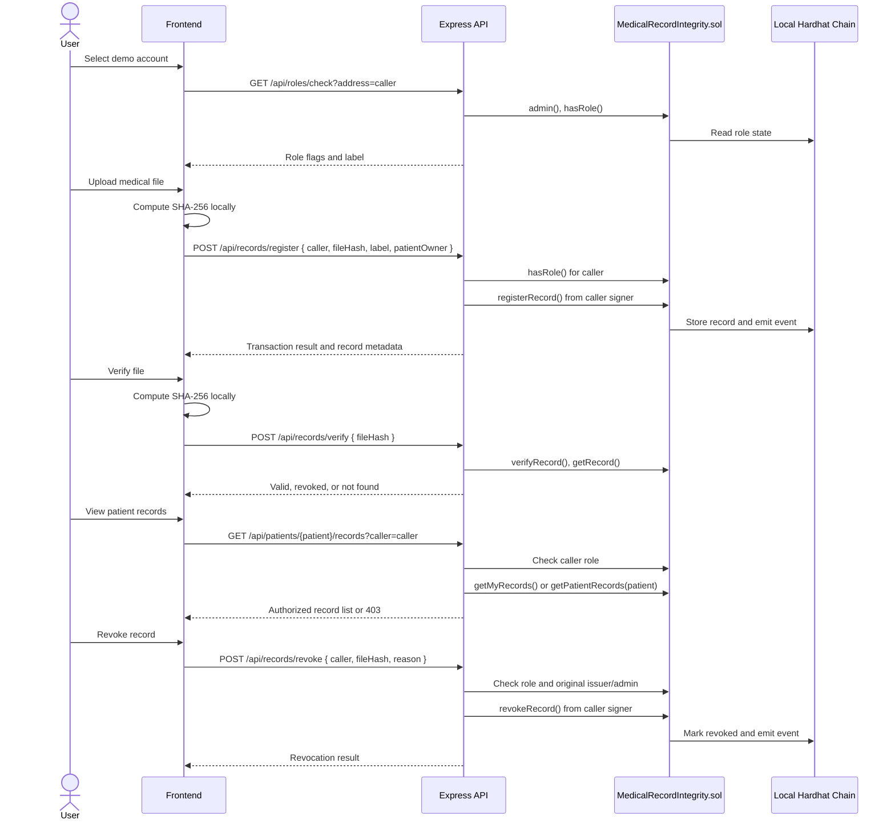

# System Actions and Sequence

## Main Actions

### Account Selection

The frontend loads seeded Hardhat accounts from `GET /api/accounts`. When an account is selected, it calls `GET /api/roles/check?address=...`. The API reads role state from `MedicalRecordIntegrity.sol` and returns role flags used to show or hide panels.

### Register Record

Doctor/Admin demo users can register records.

1. Browser computes SHA-256 locally.
2. Frontend posts `{ caller, fileHash, label, patientOwner }` to `/api/records/register`.
3. API requires `caller`, checks the caller's role on-chain, and sends the transaction from that local Hardhat signer.
4. Contract runs `onlyRegistrar`.
5. Record metadata is stored and `RecordRegistered` is emitted.

### Verify Record

Any user can verify a file or pasted fingerprint.

1. Browser computes or accepts a SHA-256 hash.
2. Frontend posts `{ fileHash }` to `/api/records/verify`.
3. API calls `verifyRecord(fileHash)` and, if found, `getRecord(fileHash)`.
4. Frontend displays valid, revoked/invalid, or not found.

### View Patient Records

Patient self-view:

1. Frontend calls `/api/patients/me/records?caller=<selected account>`.
2. API uses the caller signer and calls `getMyRecords()`.
3. Only records owned by that address are returned.

Staff patient lookup:

1. Frontend calls `/api/patients/:address/records?caller=<selected account>`.
2. API checks the caller role.
3. Same patient, Doctor, Nurse, Admin, or Hospital-style staff can view.
4. Other patients receive `403`.

### Create Version

Doctor/Admin demo users select a patient and an existing record, then upload the corrected file.

1. Browser computes the new SHA-256 hash.
2. Frontend posts `{ caller, newHash, previousHash, label, patientOwner }`.
3. API checks the caller role and validates both hashes.
4. Contract stores the new record with `previousVersionHash`.
5. Frontend shows the version chain newest-first.

### Revoke Record

Doctor/Admin demo users can use the revocation form.

1. Frontend posts `{ caller, fileHash, reason }` to `/api/records/revoke`.
2. API requires all fields, checks the caller role, loads the record, and checks original issuer/admin status.
3. Contract runs `revokeRecord`.
4. Record remains on-chain but becomes invalid.

### Role Management

Admin can grant or revoke Doctor and Nurse roles.

1. Frontend posts `{ caller, address }`.
2. API requires `caller` and checks that caller is Admin.
3. Transaction is sent from the Admin local Hardhat signer.
4. Contract runs `onlyAdmin`.

## Sequence Diagram

